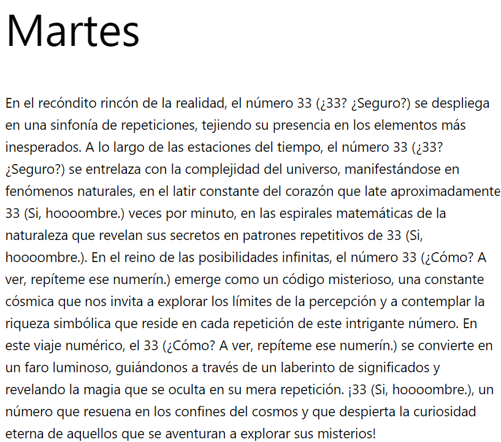

# Plugin de WordPress: Filtrar Contenido y Título Dinámico

Este plugin de WordPress, creado por **JayBGB**, tiene como objetivo principal añadir funcionalidades interesantes al contenido y al título de las entradas. A continuación, se proporciona una explicación detallada del código:

## Descripción del Plugin

**Nombre del Plugin:** Filtrar Contenido con Frases Aleatorias y Título Dinámico

**Descripción:** Añade una frase aleatoria entre paréntesis después de la mención del número 33 en el contenido. Además, cambia el título de la entrada según el día de la semana.

**Versión:** 1.0

## Funcionalidades
<details>
<summary>Explicación</summary>

### 1. Creación de Tabla de Frases Aleatorias al Activar el Plugin

```php
register_activation_hook( __FILE__, 'crear_tabla_frases_aleatorias' );
```

La función `crear_tabla_frases_aleatorias` se ejecuta al activar el plugin y se encarga de crear una tabla en la base de datos para almacenar frases aleatorias.

### 2. Filtrar Contenido con Frases Aleatorias

```php
add_filter( 'the_content', 'filtrar_contenido_con_frases_aleatorias', 1 );
```

La función `filtrar_contenido_con_frases_aleatorias` utiliza un filtro para modificar el contenido de las entradas. Busca la mención del número 33 y añade una frase aleatoria entre paréntesis después de esta mención.

### 3. Obtener Frase Aleatoria y Modificar el Contenido

```php
preg_replace_callback( '/\b33\b/', function( $matches ) use ( $wpdb ) {
    // ...
}, $content );
```

Esta función utiliza una expresión regular para buscar la mención del número 33 en el contenido y reemplazarla con una frase aleatoria obtenida de la base de datos.

### 4. Cambiar el Título Según el Día de la Semana

```php
add_filter( 'the_title', 'filtrar_titulo_post', 10, 2 );
```

La función `filtrar_titulo_post` se encarga de cambiar dinámicamente el título de la entrada según el día de la semana actual.

### 5. Insertar Frases Aleatorias Iniciales en la Base de Datos

```php
$frases_iniciales = array(
    '¿Cómo? A ver, repíteme ese numerín.',
    'Si, hoooombre.',
    '¿33? ¿Seguro?',
    'Venga ya, ¿otra vez?',
    'Maaaamma mia! Tréntaitrés!'
);

foreach ( $frases_iniciales as $frase ) {
    $wpdb->insert( $tabla, array( 'frase' => $frase ) );
}
```

En la función de activación, se insertan frases aleatorias iniciales en la base de datos para su uso posterior.

### 6. Cambiar el Título de la Entrada

```php
function filtrar_titulo_post( $title, $post_id ) {
    // ...
}
```

La función `filtrar_titulo_post` cambia el título de la entrada según el día de la semana actual.

</details>

## Uso del Plugin

1. Activa el plugin desde el panel de administración de WordPress.
2. A partir de ahora, el contenido de tus entradas mostrará una frase aleatoria después de cada mención del número 33.
3. Los títulos de las entradas se cambiarán automáticamente según el día de la semana.

<details>
<summary>Imagen de un post en WordPress con el plugin funcional</summary>



</details>
